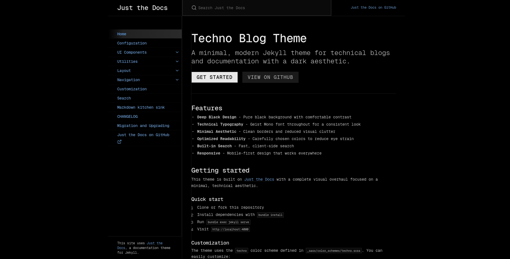

# Techno Blog Theme

A minimal, modern Jekyll theme for technical blogs and documentation with a dark aesthetic. Built as a fork of [Just the Docs](https://github.com/just-the-docs/just-the-docs) with a complete visual overhaul focused on readability and a clean, technical look.



## Features

- **Deep Black Design** - Pure black (#000000) background with comfortable contrast
- **Technical Typography** - Geist Mono font throughout for a consistent monospace aesthetic
- **Minimal Borders** - Clean, subtle borders that define spaces without overwhelming
- **Optimized Readability** - Reduced font sizes and carefully chosen gray tones to reduce eye strain
- **High Contrast Elements** - Buttons and interactive elements with clear visibility
- **Built-in Search** - Inherited from Just the Docs
- **Responsive Design** - Mobile-first approach
- **Easy Customization** - Simple SCSS variables for colors and spacing

## Installation

### Local Development

1. Clone this repository:
```bash
git clone <your-repo-url>
cd technoblog
```

2. Install dependencies:
```bash
bundle install
```

3. Serve the site locally:
```bash
bundle exec jekyll serve
```

4. Open your browser to `http://localhost:4000`

### GitHub Pages

1. Fork this repository
2. Enable GitHub Pages in repository settings
3. Choose the branch to deploy (usually `master` or `main`)
4. Your site will be published at `https://<username>.github.io/<repository-name>`

## Customization

### Color Scheme

The color scheme is defined in `_sass/color_schemes/techno.scss`. Key colors:

```scss
$body-background-color: #000000;  // Pure black background
$body-text-color: #c0c0c0;        // Soft gray text
$body-heading-color: #e8e8e8;     // Light gray headings
$link-color: #6b9bd1;             // Muted blue links
$border-color: #1a1a1a;           // Subtle borders
```

### Typography

Font settings are in `_sass/custom/setup.scss` and `_sass/custom/custom.scss`:

```scss
$body-font-family: 'Geist Mono', ui-monospace, 'SFMono-Regular', Menlo, Monaco, Consolas, monospace;
```

The base font size is set to 14px for a more compact, technical feel.

### Configuration

Edit `_config.yml` to update:
- Site title and description
- Navigation settings
- Search configuration
- Theme settings

## Creating Content

### Pages

Create markdown files in the root or `docs/` directory:

```markdown
---
title: Your Page Title
layout: default
nav_order: 1
---

# Your Content Here
```

### Navigation

Control navigation order with front matter:

```yaml
nav_order: 1
parent: Parent Page Name  # For nested pages
```

## Design Philosophy

This theme prioritizes:

1. **Minimal Distraction** - Dark background keeps focus on content
2. **Technical Aesthetic** - Monospace fonts and clean lines
3. **Easy on the Eyes** - Reduced contrast to prevent eye strain during long reading sessions
4. **Fast Loading** - Few dependencies, no build scripts
5. **Content First** - Simple design that makes your content shine

## Credits

This theme is built on top of [Just the Docs](https://github.com/just-the-docs/just-the-docs) by Patrick Marsceill and the Just the Docs contributors. The original theme provided the excellent foundation of navigation, search, and responsive layout.

The Techno theme modifications focus on visual design, typography, and dark mode optimization.

## License

The theme is available as open source under the terms of the [MIT License](http://opensource.org/licenses/MIT).

## Contributing

Issues and pull requests are welcome! If you find bugs or have suggestions for improvements, please open an issue.
